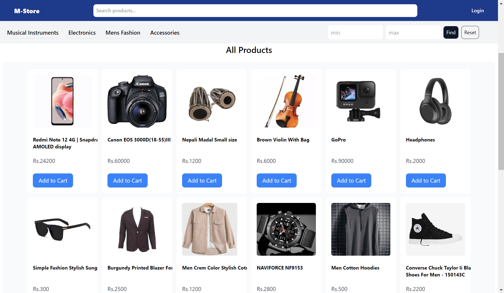

# MERN Ecommerce

This is an Ecommerce application built using the MERN stack (MongoDB, Express.js, React.js, Node.js). It provides both admin and user features for managing and purchasing products.

## Features

### Admin Features

- **Product Management**: Add, update, and delete products.
- **Order Management**: View and manage orders placed by users.

### User Features

- **Product Browsing**: Browse and search for products.
- **Product Details**: View detailed information about a product.
- **Shopping Cart**: Add products to a shopping cart and proceed to checkout.
- **Order Placement**: Place orders for selected products.
- **Order History**: View past orders and order details.

### Preview Image

